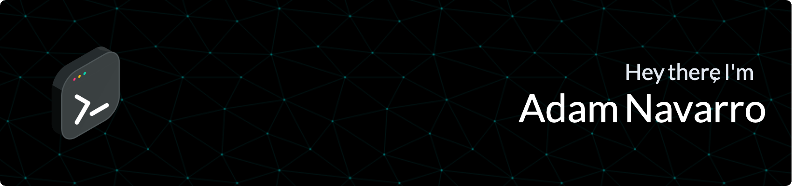

<!-- SOCIAL_BADGES:START -->

<a href="mailto:adamjnav@gmail.com">
	<picture>
		<source srcset="https://img.shields.io/badge/adamjnav-F2F5F8?logo=gmail&logoColor=AF5BC2&style=for-the-badge&logoSize=auto" media="(prefers-color-scheme: light)" />
		
	</picture>
</a>
<a href="https://x.com/AdamJNavarro">
	<picture>
		<source srcset="https://img.shields.io/badge/AdamJNavarro-F2F5F8?logo=x&logoColor=AF5BC2&style=for-the-badge&logoSize=auto" media="(prefers-color-scheme: light)" />
		
	</picture>
</a>
<a href="https://instagram.com/adamjnavarro">
	<picture>
		<source srcset="https://img.shields.io/badge/adamjnavarro-F2F5F8?logo=instagram&logoColor=AF5BC2&style=for-the-badge&logoSize=auto" media="(prefers-color-scheme: light)" />
		
	</picture>
</a>

<!-- SOCIAL_BADGES:END -->

 
 

Hey there, my name is Adam! I’m a
coder, fitness enthusiast, music &
dance lover, and a dog owner to a
Wheaten Terrier named Ace.

To find out more about me, hop on over to [my website.](https://adamjnavarro.com)

 
 

<picture>
    <source srcset="https://github-readme-stats-flame-phi-47.vercel.app/api?username=adamjnavarro&hide=stars&border_radius=6&hide_border=true&show_icons=true&line_height=30&bg_color=F2F5F8&title_color=000000&text_color=1C2835&icon_color=00A3A0&ring_color=00A3A0" media="(prefers-color-scheme: light)" />
    
</picture>

 
 

## My Stack

 
 

**Languages**

<!-- LANGUAGE_BADGES:START -->

<picture>
	<source srcset="https://img.shields.io/badge/JavaScript-F2F5F8?logo=javascript&logoColor=00A3A0&style=for-the-badge&logoSize=auto" media="(prefers-color-scheme: light)" />
	
</picture>
<picture>
	<source srcset="https://img.shields.io/badge/TypeScript-F2F5F8?logo=typescript&logoColor=00A3A0&style=for-the-badge&logoSize=auto" media="(prefers-color-scheme: light)" />
	
</picture>
<picture>
	<source srcset="https://img.shields.io/badge/HTML-F2F5F8?logo=html5&logoColor=00A3A0&style=for-the-badge&logoSize=auto" media="(prefers-color-scheme: light)" />
	
</picture>
<picture>
	<source srcset="https://img.shields.io/badge/CSS-F2F5F8?logo=css3&logoColor=00A3A0&style=for-the-badge&logoSize=auto" media="(prefers-color-scheme: light)" />
	
</picture>

<!-- LANGUAGE_BADGES:END -->

 
 

**Frameworks**

<!-- FRAMEWORK_BADGES:START -->

<picture>
	<source srcset="https://img.shields.io/badge/React-F2F5F8?logo=react&logoColor=00A3A0&style=for-the-badge&logoSize=auto" media="(prefers-color-scheme: light)" />
	
</picture>
<picture>
	<source srcset="https://img.shields.io/badge/Next.js-F2F5F8?logo=nextdotjs&logoColor=00A3A0&style=for-the-badge&logoSize=auto" media="(prefers-color-scheme: light)" />
	
</picture>
<picture>
	<source srcset="https://img.shields.io/badge/Core-F2F5F8?logo=dotnet&logoColor=00A3A0&style=for-the-badge&logoSize=auto" media="(prefers-color-scheme: light)" />
	
</picture>
<picture>
	<source srcset="https://img.shields.io/badge/Storybook-F2F5F8?logo=storybook&logoColor=00A3A0&style=for-the-badge&logoSize=auto" media="(prefers-color-scheme: light)" />
	
</picture>
<picture>
	<source srcset="https://img.shields.io/badge/TailwindCSS-F2F5F8?logo=tailwindcss&logoColor=00A3A0&style=for-the-badge&logoSize=auto" media="(prefers-color-scheme: light)" />
	
</picture>
<picture>
	<source srcset="https://img.shields.io/badge/Lit-F2F5F8?logo=lit&logoColor=00A3A0&style=for-the-badge&logoSize=auto" media="(prefers-color-scheme: light)" />
	
</picture>
<picture>
	<source srcset="https://img.shields.io/badge/PostgreSQL-F2F5F8?logo=postgresql&logoColor=00A3A0&style=for-the-badge&logoSize=auto" media="(prefers-color-scheme: light)" />
	
</picture>
<picture>
	<source srcset="https://img.shields.io/badge/Cypress-F2F5F8?logo=cypress&logoColor=00A3A0&style=for-the-badge&logoSize=auto" media="(prefers-color-scheme: light)" />
	
</picture>

<!-- FRAMEWORK_BADGES:END -->

 
 

**Services**

<!-- SERVICE_BADGES:START -->

<picture>
	<source srcset="https://img.shields.io/badge/Github-F2F5F8?logo=github&logoColor=00A3A0&style=for-the-badge&logoSize=auto" media="(prefers-color-scheme: light)" />
	
</picture>
<picture>
	<source srcset="https://img.shields.io/badge/Docker-F2F5F8?logo=docker&logoColor=00A3A0&style=for-the-badge&logoSize=auto" media="(prefers-color-scheme: light)" />
	
</picture>
<picture>
	<source srcset="https://img.shields.io/badge/Chromatic-F2F5F8?logo=chromatic&logoColor=00A3A0&style=for-the-badge&logoSize=auto" media="(prefers-color-scheme: light)" />
	
</picture>
<picture>
	<source srcset="https://img.shields.io/badge/Cloudinary-F2F5F8?logo=cloudinary&logoColor=00A3A0&style=for-the-badge&logoSize=auto" media="(prefers-color-scheme: light)" />
	
</picture>

<!-- SERVICE_BADGES:END -->

 
 

**Tools**

<!-- TOOL_BADGES:START -->

<picture>
	<source srcset="https://img.shields.io/badge/Git-F2F5F8?logo=git&logoColor=00A3A0&style=for-the-badge&logoSize=auto" media="(prefers-color-scheme: light)" />
	
</picture>
<picture>
	<source srcset="https://img.shields.io/badge/NPM-F2F5F8?logo=npm&logoColor=00A3A0&style=for-the-badge&logoSize=auto" media="(prefers-color-scheme: light)" />
	
</picture>
<picture>
	<source srcset="https://img.shields.io/badge/Yarn-F2F5F8?logo=yarn&logoColor=00A3A0&style=for-the-badge&logoSize=auto" media="(prefers-color-scheme: light)" />
	
</picture>
<picture>
	<source srcset="https://img.shields.io/badge/ESLint-F2F5F8?logo=eslint&logoColor=00A3A0&style=for-the-badge&logoSize=auto" media="(prefers-color-scheme: light)" />
	
</picture>
<picture>
	<source srcset="https://img.shields.io/badge/commitlint-F2F5F8?logo=commitlint&logoColor=00A3A0&style=for-the-badge&logoSize=auto" media="(prefers-color-scheme: light)" />
	
</picture>
<picture>
	<source srcset="https://img.shields.io/badge/Prettier-F2F5F8?logo=prettier&logoColor=00A3A0&style=for-the-badge&logoSize=auto" media="(prefers-color-scheme: light)" />
	
</picture>

<!-- TOOL_BADGES:END -->
